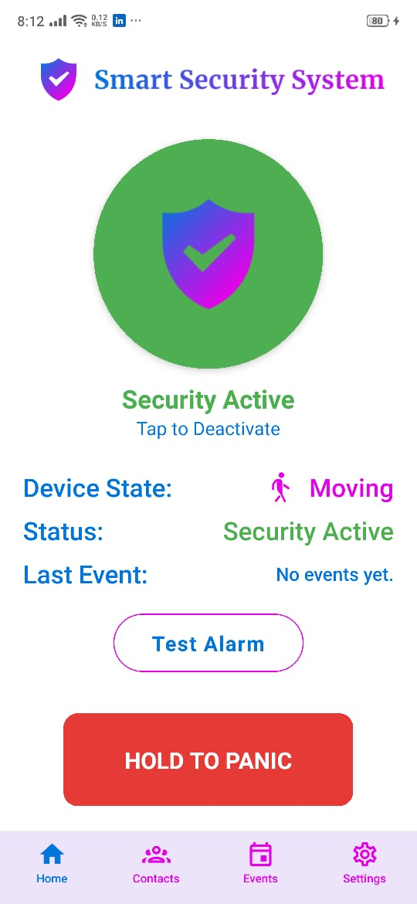
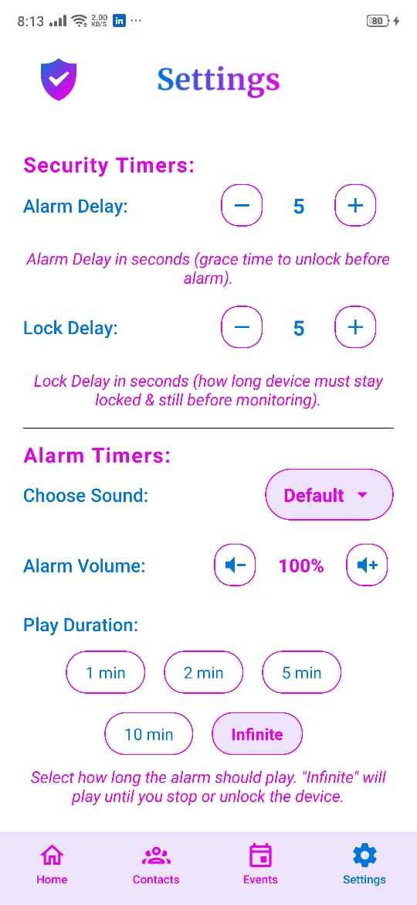
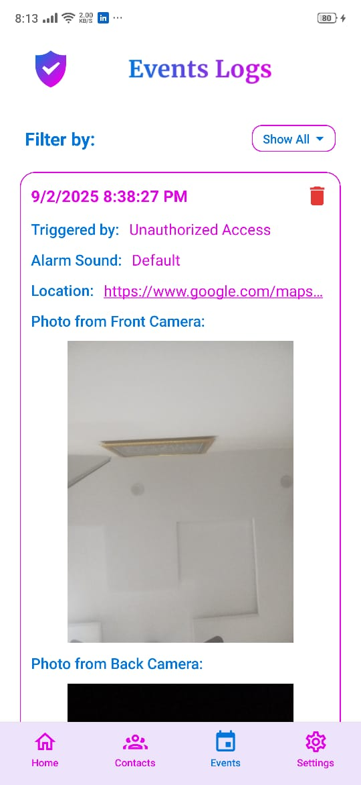
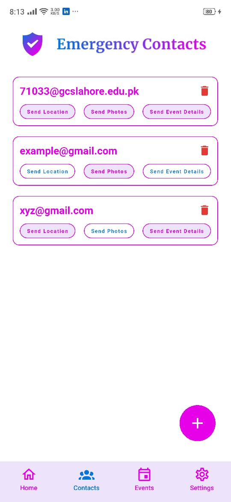

# 🛡️ Smart Security System

[](https://reactnative.dev/)
[](https://firebase.google.com/)
[](https://developer.android.com/)
[](LICENSE)

> A comprehensive mobile security application that provides proactive protection against unauthorized access and theft through intelligent motion detection, automated alerts, and emergency contact notifications.

## 📱 Overview

Smart Security System is an advanced React Native application designed to protect your mobile device from theft and unauthorized access. Unlike traditional security apps that only rely on lock screens, this app uses device sensors and intelligent triggers to provide real-time protection and emergency notifications.

### 🎯 Key Features

- **🔍 Motion Detection**: Uses accelerometer to detect when device is stationary vs. in motion
- **📸 Automatic Camera Capture**: Takes photos from both front and back cameras when security is triggered
- **📍 Location Tracking**: Captures and shares real-time GPS location with emergency contacts
- **🔊 Customizable Alarms**: Multiple alarm sounds with adjustable volume and duration
- **👥 Emergency Contacts**: Send automated alerts to predefined contacts via email
- **📊 Security Logs**: Comprehensive logging of all security events with timestamps
- **⚙️ Full Customization**: Adjust trigger delays, alarm settings, and notification preferences
- **🌙 Background Operation**: Continues monitoring even when app is in background

## 🏗️ Architecture

### Technology Stack

- **Frontend**: React Native with TypeScript
- **Backend Services**: Node.js API for notifications
- **Database**: Firebase Firestore for logs and user data
- **Audio**: React Native Track Player
- **Camera**: CameraX (Android)
- **Location**: React Native Geolocation

### Core Components

```
src/
├── components/          # Reusable UI components
├── screens/            # Main application screens
├── hooks/              # Custom React hooks
├── utils/              # Utility functions
├── services/           # External service integrations
├── context/            # React Context providers
├── navigation/         # Navigation configuration
└── types/              # TypeScript type definitions
```

## 🚀 Getting Started

### Prerequisites

- Node.js 18+ and npm/yarn
- React Native CLI
- Android Studio with SDK
- Java Development Kit (JDK) 11+
- Firebase project setup

### Installation

1. **Clone the repository**
   ```bash
   git clone https://github.com/sermadahmad/SmartSecuritySystem.git
   cd SmartSecuritySystem
   ```

2. **Install dependencies**
   ```bash
   npm install
   # or
   yarn install
   ```

3. **Firebase Configuration**
   - Create a Firebase project
   - Download `google-services.json` and place in `android/app/`
   - Update Firebase configuration in the app

4. **Android Setup**
   ```bash
   npx react-native run-android
   ```

### 🔧 Configuration

#### Permissions
The app requires the following permissions:
- Camera access
- Location access (foreground and background)
- Microphone access
- External storage access
- Foreground service

## 📖 Usage

### Basic Setup

1. **Add Emergency Contacts**: Configure emergency contacts
2. **Customize Settings**: 
   - Set trigger delays (lock delay, alarm delay)
   - Choose alarm sounds and volume
   - Configure notification preferences
3. **Activate Security**: Toggle security monitoring on/off

### Security Workflow

1. **Device Placement**: Place phone on a stable surface
2. **Motion Detection**: App detects when device becomes stationary
3. **Lock Detection**: Monitors device lock status
4. **Trigger Conditions**: Security activates if device is moved while locked
5. **Response Actions**:
   - Play customizable alarm
   - Capture photos from both cameras
   - Get current GPS location
   - Send alerts to emergency contacts
   - Log security event

### 🎛️ Customization Options

| Setting | Description | Options |
|---------|-------------|---------|
| Lock Delay | Time before security activates | 0-60 seconds |
| Alarm Delay | Time before alarm triggers | 0-30 seconds |
| Alarm Sound | Notification sound | 7 built-in sounds |
| Alarm Volume | Sound intensity | 0-100% |
| Alarm Duration | How long alarm plays | 5s - Infinite |
| Location Sharing | Include GPS in alerts | On/Off |
| Photo Capture | Include photos in alerts | On/Off |

## 🔧 Advanced Features

### Background Processing
- Utilizes foreground services for continuous monitoring
- Background timers for detection logic
- Optimized battery usage

### Security Event Logging
- Detailed event tracking with timestamps
- Photo storage and management

### Emergency Notifications
- Real-time email alerts to contacts
- Location sharing with Google Maps links
- Photo attachments in notifications

## 🛠️ Development

### Building for Production

```bash
# Android Release Build
cd android
./gradlew assembleRelease

# Generate Signed APK
./gradlew bundleRelease
```

## 📱 Screenshots

| Home Screen | Security Settings | Event Logs | Contact Management |
|-------------|-------------------|------------|-------------------|
|  |  |  |  |

### 📹 Demo Video


## 🤝 Contributing

We welcome contributions! Please see our [Contributing Guidelines](CONTRIBUTING.md) for details.

1. Fork the repository
2. Create a feature branch (`git checkout -b feature/AmazingFeature`)
3. Commit your changes (`git commit -m 'Add some AmazingFeature'`)
4. Push to the branch (`git push origin feature/AmazingFeature`)
5. Open a Pull Request

## 📄 License

This project is licensed under the MIT License - see the [LICENSE](LICENSE) file for details.

## 👨‍💻 Author

**Sermad Ahmad**
- GitHub: [@sermadahmad](https://github.com/sermadahmad)
- Email: sermadahamd024@gmail.com
- LinkedIn: [Sermad Ahmad](https://www.linkedin.com/in/sermadahmad)

## 🙏 Acknowledgments

- React Native community for excellent documentation
- Firebase team for robust backend services

### Support

For support, please create an issue on GitHub or contact the development team.

## 🗺️ Roadmap

### Version 2.0 (Planned)
- [ ] iOS support
- [ ] Face detection integration
- [ ] Cloud backup for settings
- [ ] Remote device control
- [ ] AI-based threat detection
- [ ] Multi-language support
- [ ] Dark mode theme

### Version 1.5 (In Progress)
- [x] Enhanced camera capture in background
- [x] Improved battery optimization
- [ ] Better error handling
- [ ] Performance optimizations

## 🔧 Technical Notes

### Known Patches Required

The following patches are required for proper functionality:

#### @voximplant/react-native-foreground-service
- Change compile SDK version to 35
- Remove buildToolsVersion from build.gradle

### Android Manifest Requirements

Ensure the following configurations in `AndroidManifest.xml`:

```xml
<uses-permission android:name="android.permission.CAMERA" />
<uses-permission android:name="android.permission.FOREGROUND_SERVICE" />
<uses-permission android:name="android.permission.FOREGROUND_SERVICE_CAMERA" />
<uses-permission android:name="android.permission.ACCESS_FINE_LOCATION" />
<uses-permission android:name="android.permission.ACCESS_BACKGROUND_LOCATION" />

<service
  android:name=".SecurityCameraService"
  android:exported="false"
  android:enabled="true"
  android:foregroundServiceType="camera" />
```

---

*Made with ❤️ by Sermad Ahmad - Final Year Capstone Project*
